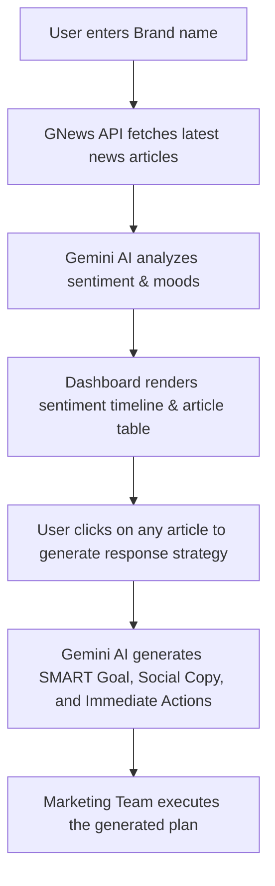

# StratPulse

StratPulse is a real-time, AI-powered Brand Sentiment Analysis and Strategy Generator. It empowers marketing teams, PR professionals, and brand managers to monitor news coverage, evaluate public sentiment instantly, and generate immediate, actionable response strategies using Google's Gemini models.

---

## 🌟 Key Features & Advantages

- **Real-Time News Monitoring**: Integrates with GNews API to fetch the latest articles, headlines, and coverages for any brand.
- **AI-Powered Sentiment Engine**: Leverages `gemini-2.5-flash` to evaluate complex articles and headlines, assigning precise sentiment scores and mood classifications (Positive, Neutral, Negative).
- **Automated Crisis & Opportunity Strategy**: Instantly drafts SMART goals, recommended actions, and executive summaries for critical news updates.
- **Ready-to-Post Social Copy**: Generates customized copy for Twitter/X (with character limits), LinkedIn (professional tone), and Instagram (complete with trending hashtags) based on the news mood.
- **Secure Authentication**: Built-in authentication with NextAuth.js to protect sensitive brand dashboards.
- **Modern UI/UX**: Includes a dark/light mode toggle, dynamic sentiment timelines, and clean data visualizations.

---

## ⚙️ How it Works (Workflow)



1. **Brand Search**: User inputs the target brand name in the StratPulse dashboard.
2. **Data Ingestion**: The system queries the GNews API, bringing back the latest relevant articles sorted by date.
3. **Sentiment Extraction**: The headlines are parsed and sent to Gemini, which returns structured JSON detailing sentiment scores and moods.
4. **Data Visualization**: Headlines are listed with color-coded sentiment tags alongside a timeline highlighting trend directions.
5. **Strategy Generation**: For critical or negative news, users can trigger the strategy engine. Gemini constructs an immediate response framework including SMART goals and platform-specific social updates.

---

## 💡 Practical Uses

- **Crisis Management**: Instantly spot negative press and auto-generate mitigation strategies, messaging guidelines, and immediate team actions.
- **Brand Reputation Tracking**: Track how product launches, PR campaigns, or executive announcements affect public sentiment.
- **Competitive Intelligence**: Analyze competitor brands to understand where they are gaining positive exposure or suffering public relations setbacks.
- **Content Marketing & Social Alignment**: Quick creation of relevant social media posts aligned with active news trends.

---

## 🚀 Getting Started

### Prerequisites

Create a `.env.local` file in the root directory and configure the following environment variables:

```env
NEXTAUTH_SECRET=your_nextauth_secret
NEXTAUTH_URL=http://localhost:3000

GNEWS_API_KEY=your_gnews_api_key
GEMINI_API_KEY=your_gemini_api_key
```

### Installation

1. Install dependencies:
   ```bash
   npm install
   ```

2. Run the development server:
   ```bash
   npm run dev
   ```

3. Open [http://localhost:3000](http://localhost:3000) in your browser to view the application.
